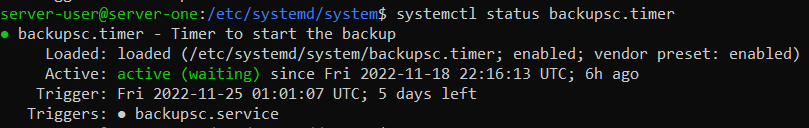
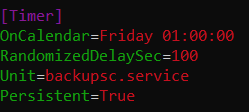

# ACIT 2420 Week 11 Lab - backup

## Team Members
Jacky Hsu
Byeongju(Jace) Kang

## Backup
Script to backup the files/directories from server-one to backup-server

### backupsc
1. Create directory */opt/backupScript* using `mkdir /opt/backupScript`.
2. Save this file into the directory you created.
3. Change the name from **jace** to your user name.
4. Change the **SSH key** to your own SSH key. This part is inside double quotes in the capture below.

### config.sh
1. Save this file into the same directory as **backupsc** file.
- `/opt/backupScript`
2. Change the *dir* as you wish to backup to.
3. Change the *ip* to your backup server ip address.
 

### backupsc.service
1. Save this file into */etc/systemd/system* directory.
2. Using the command `sudo systemctl enable backupsc.service` to enable the service file.
3. Run the command `systemctl status backupsc.service` to check that **backupsc.service** file is enabled.

### backupsc.timer
1. Save this file into */etc/systemd/system* directory.
2. Using the command `sudo systemctl enable backupsc.timer` to enable the timer file.
3. Run the command `systemctl status backupsc.timer` to check that **backupsc.timer** file is enabled.
 

### Reload configuration
After you enable service and timer file, 
run the command `sudo systemctl daemon-reload` to reload configuration.

### How to test script
To test script,
1. Change the *OnCalendar* in **backupsc.timer** file to closest time.

2. Run the command `systemctl list-timers` to check if there is a *backupsc.timer* in UNIT section.
3. Check the *NEXT* section to make sure the time you set up is schduled.

4. After the time you set up is passed, check your backup server if it includes files/directories you backed up.
5. Change the *OnCalendar* time in **backupsc.timer** file back to original.
6. Run the command `sudo systemctl daemon-reload` to reload configuration.